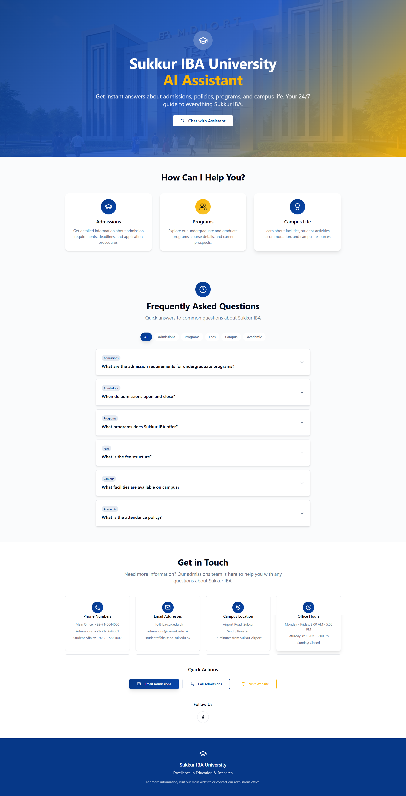
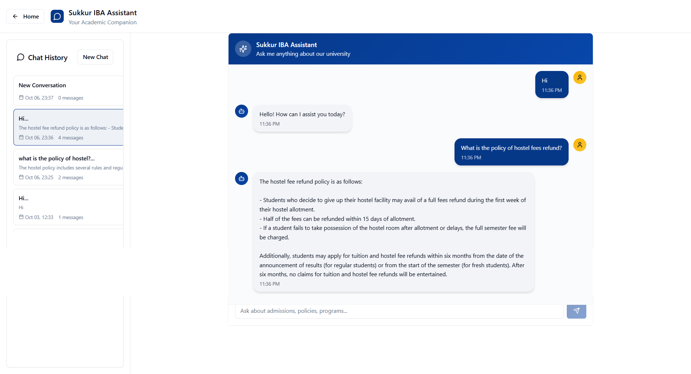

# Sukkur IBA Policy Chatbot

A full-stack chatbot for querying university policy PDFs using a FastAPI backend (LangChain + OpenAI + FAISS) and a React (Vite + TypeScript + Tailwind) frontend.

## Project Structure

```
IBA_chatbot/
├─ backend/
│  ├─ policy_chatbot.py         # FastAPI app with LangChain pipeline
│  ├─ requirements.txt          # Python dependencies
│  ├─ faiss_index/              # Generated FAISS index (auto-created)
│  ├─ __pycache__/
│  └─ .env                      # Add your secrets here (not committed)
├─ frontend/
│  ├─ package.json              # npm scripts (dev/build/preview)
│  ├─ vite.config.ts
│  ├─ src/
│  └─ public/
├─ Policy/                      # PDF source documents (local path scanned)
├─ website.png                  # Project screenshot
├─ chatbot.png                  # Chat UI screenshot
└─ README.md
```

## Prerequisites

- Python 3.10+
- Node.js 18+ and npm
- An OpenAI API key

## Backend (FastAPI)

Path: `backend/`

- App entry: `backend/policy_chatbot.py` defines `app` (FastAPI)
- Default dev server command (choose one):
  - Using uvicorn directly:
    ```bash
    uvicorn backend.policy_chatbot:app --reload --port 8000
    ```
  - Or via Python module:
    ```bash
    python -m uvicorn backend.policy_chatbot:app --reload --port 8000
    ```

### Setup

```bash
# From project root
python -m venv .venv
. .venv/Scripts/activate   # Windows PowerShell: .venv\Scripts\Activate.ps1
pip install -r backend/requirements.txt
```

Create `backend/.env` with:

```
OPENAI_API_KEY=your_key_here
# Optional: override model (defaults to gpt-4o-mini)
# OPENAI_MODEL=gpt-4o-mini
# Optional: where to store the FAISS index
# FAISS_INDEX_DIR=backend/faiss_index
```

The code currently scans PDFs from:
```
POLICY_DIR = C:\\Users\\dilee\\Desktop\\IBA_chatbot\\Policy
```
You can change this path inside `backend/policy_chatbot.py` or adapt it to read from an env var if needed.

### API Endpoints

- `POST /api/ask` → `{ question: string }` → `{ answer: string }`
- `POST /api/reindex` → rebuilds FAISS from `POLICY_DIR`
- `GET /healthz` → `{ status: "ok" }`

CORS is open to all origins by default in `policy_chatbot.py`. Tighten for production.

## Frontend (React + Vite + TS + Tailwind)

Path: `frontend/`

Scripts from `frontend/package.json`:

```json
{
  "scripts": {
    "dev": "vite",
    "build": "vite build",
    "build:dev": "vite build --mode development",
    "lint": "eslint .",
    "preview": "vite preview"
  }
}
```

### Setup & Run

```bash
# From project root
cd frontend
npm install
npm run dev    # Vite dev server (defaults to http://localhost:5173)
```

Build & preview:
```bash
npm run build
npm run preview
```

### Frontend-Backend Integration

- The frontend should send chat requests to the backend `POST /api/ask` endpoint. Ensure the base URL points to your backend (e.g., `http://localhost:8000`). If needed, configure a proxy in `vite.config.ts`.

## Screenshots

Project screenshots stored in the repository root:





## Development Tips

- Keep `.env` files out of git (covered by `.gitignore`).
- If you change PDFs in `Policy/`, call `POST /api/reindex` to refresh the index.
- For large PDF sets, the first index build may take time.
- Consider making `POLICY_DIR` configurable via `.env` for portability.

## Deployment Notes

- Backend: containerize or deploy on a Python host (Uvicorn/Gunicorn + reverse proxy). Ensure `OPENAI_API_KEY` and `FAISS_INDEX_DIR` are set.
- Frontend: `npm run build` creates static assets (e.g., deploy to Netlify, Vercel, or any static host). Configure API base URL to your deployed backend.
